# FlameGuard AI: Real-Time Fire and Smoke Detection Using Transfer Learning

**AASD 4014 - Deep Learning II**

**Group [GROUP NUMBER]**

- [Project Manager]  -  Project Manager
- [Dataset & EDA Lead]
- [Model Training Lead]
- [Application Development Lead]
- [Evaluation & Documentation Lead]

Submission date: [SUBMISSION DATE]

---

---

## Table of Contents

*(generated automatically in the DOCX and PDF versions)*

---

## Executive Summary

FlameGuard AI detects fire and smoke in images, video files and live camera streams. A YOLO object detector was fine-tuned by transfer learning on a public Roboflow dataset of 5,300 images (7,225 annotations across two classes, Fire and Smoke).

The most consequential finding of the project came before any training: 3,379 of the 5,300 images (64%) belonged to duplicate or near-duplicate groups that the published dataset had scattered across its train, validation and test folders. Evaluating on those splits would have measured memorisation, not generalisation. We rebuilt the splits group-wise (perceptual-hash clustering, fixed seed) so that no source image appears in more than one split, and every number in this report comes from that repaired dataset.

The selected final model (YOLO11n tuned (80ep, cls=1.0)) reaches mAP@0.5 = 0.505, mAP@0.5:0.95 = 0.246, precision = 0.591 and recall = 0.476 on the held-out test split, which was evaluated exactly once. Per class, AP@0.5 is 0.513 for Fire and 0.498 for Smoke. Measured inference speed on the project laptop is 18.2 ms per image (55.0 FPS) on GPU and 66 ms (15.2 FPS) on CPU. The model runs inside a Streamlit application offering image upload, video processing and live browser webcam detection, with an OpenCV desktop fallback.

FlameGuard AI is an educational computer-vision prototype. It is not a certified fire-detection or emergency-response system and must not replace smoke detectors, fire alarms, emergency procedures, or human supervision.

## Scope and Completeness (read this first)

This project ran on a single 4 GB laptop GPU on which mixed precision is automatically disabled, and the experiment programme was sized to that constraint. We state its limits here, up front, rather than leaving a reader to discover them:

- The YOLOv8s capacity experiment WAS COMPLETED, at batch 2 - the only batch size that fits 4 GB of VRAM. We first measured why larger batches fail (Section 7: batch 8 needs 7.94 GB, batch 4 needs 6.08 GB on a 4 GB card, both spilling to system RAM at ~2.6 img/s), then trained at batch 2 (18 epochs). Because Ultralytics gradient-accumulates to a nominal batch of 64 regardless of the micro-batch, only the BatchNorm statistics actually see batch 2; the optimiser step matches the other runs. Its real numbers appear in the benchmark (Section 7).
- Epoch budgets are shorter than convergence. The 40-epoch baseline had not fully plateaued; the comparison runs are shorter still. Models trained for different lengths are therefore also compared AT EQUAL EPOCHS using the per-epoch validation curves, and that caveat is repeated wherever a comparison is drawn.
- Everything in this report - the dataset audit and leakage repair, the EDA, the probe study, all architecture runs, the final model, the single-shot test evaluation, the error analysis, the application, and the tests - was completed and is reported from saved artefacts.

No number in this document was typed in by hand. Every metric, table and figure is read at build time from a file that a script produced, so a claim here and the artefact behind it cannot drift apart. Where an experiment did not happen, the report says so.

## Team Contribution Table

**Table 1: Team contributions (full detail in agile/contribution_table.csv)**

| Team member | Role | Primary tasks | Report sections | Status |
|---|---|---|---|---|
| [Project Manager] | Project Manager | Coordination, timelines, Scrum artefacts, presentation assembly | Sections 1, 2, 9 | Complete |
| [Dataset & EDA Lead] | Dataset & EDA Lead | Dataset validation, leakage repair, re-split, EDA package | Section 3 | Complete |
| [Model Training Lead] | Model Training Lead | Transfer-learning experiments, tuning probes, final model | Sections 4, 6 | Complete |
| [Application Development Lead] | Application Development Lead | Streamlit app, live webcam, video pipeline, OpenCV fallback | Section 8 | Complete |
| [Evaluation & Documentation Lead] | Evaluation & Documentation Lead | Test evaluation, threshold analysis, error analysis, report, tests | Sections 5, 7, 10-15 | Complete |

---

## 1. Background and Problem Statement

Fire causes tens of thousands of deaths and billions of dollars of damage worldwide each year, and the interval between ignition and alarm is among the strongest predictors of how severe an incident becomes. Conventional point sensors - ionisation and photoelectric smoke detectors - only trigger once smoke physically reaches the device. In large or open spaces (warehouses, atriums, industrial yards, forests) that can take minutes, or never happen at all if airflow carries the plume away.

Camera-based detection complements those sensors. A vision model can monitor a wide area continuously, react to the visual signature of flame or a rising plume within a frame or two, and localise the hazard so a human can verify it. Cameras are already installed almost everywhere, which makes the marginal cost of adding detection software low.

The task is genuinely hard. Fire varies enormously in colour, scale, texture and shape. Smoke is semi-transparent, has little internal texture, changes shape constantly, and is easily confused with fog, steam, dust or cloud. Conversely, sunsets, orange sodium lamps and reflections mimic flame. A useful detector must therefore balance recall (a missed fire is the expensive failure) against precision (false alarms destroy operator trust and get systems switched off).

### 1.1 Objective and scope

Objective: given an image, a video file, or a live camera stream, detect and localise every visible instance of fire and smoke, returning bounding boxes, class labels and confidence scores in near real time on commodity hardware, using a locally-trained model with no paid inference API.

- In scope: two object classes (Fire, Smoke); transfer learning from pretrained detection weights; dataset validation and EDA; hyperparameter tuning; benchmarking; error analysis; a deployable application with image, video and live-camera modes; downloadable outputs.
- Out of scope: certified safety operation, thermal/infrared input, multi-camera fusion, alert dispatch to emergency services, and person or identity recognition of any kind.
- Constraints: a single 4GB laptop GPU; a public dataset that we may not re-annotate; and a fixed academic timeline of four sprints.

### 1.2 Research questions and success criteria

- RQ1 - Does the published dataset's own train/validation/test split support trustworthy evaluation, and if not, what does repairing it cost in measured performance?
- RQ2 - Does a larger backbone (YOLOv8s vs YOLOv8n) improve detection, and specifically does it help the harder Smoke class, at equal training budget?
- RQ3 - Which confidence threshold best balances precision and recall for a safety-oriented detector, and what does the trade-off actually look like?
- RQ4 - What are the dominant failure modes, and what would fix them?
- Success criteria, deliberately stated as process rather than as a target number: at least two classes with >=200 original images each, verified programmatically; a fine-tuned - never unchanged - pretrained model; an evaluation protocol in which the test split is touched exactly once, after the model and threshold are frozen; inference fast enough to drive a live camera on the available hardware; failure modes characterised rather than hidden; and a working, demonstrable application. We deliberately did NOT set a target mAP in advance. On a dataset whose published split we had to rebuild, any number fixed beforehand would have been a number invented beforehand, and it would have created pressure to reach it.

## 2. Plan of Attack

We worked in four one-week Scrum sprints (Section 9). The technical plan deliberately front-loaded data integrity, because a model trained on a leaky split produces numbers that look excellent and mean nothing.

- Sprint 1 - Acquire the dataset and verify its licence; audit every image and label; detect duplicates and cross-split leakage; rebuild the splits if leakage is confirmed; run EDA to inform augmentation, image size and model choices.
- Sprint 2 - Set up a CUDA environment; fine-tune a fast baseline (YOLOv8n) to establish a reference; fine-tune a larger model (YOLOv8s) to test whether capacity helps; log every run in a single experiment table.
- Sprint 3 - Run controlled single-variable tuning probes (optimizer, augmentation strength, classification-loss weight) against a control at equal budget; train the tuned final model; build the Streamlit application and the OpenCV fallback.
- Sprint 4 - Choose the operating threshold on validation data; evaluate once on the untouched test split; analyse errors; produce the report, slides, sample outputs, tests and the submission package.

Why transfer learning rather than training from scratch: COCO-pretrained YOLO weights already encode generic edge, texture and shape features learned from 118,000 images. Fine-tuning adapts those features to fire and smoke with a small fraction of the data and compute that training from random initialisation would require - which is decisive on a 4GB laptop GPU. The course also requires that pretrained models be adapted, not merely demonstrated, so every experiment here fine-tunes all layers on the custom dataset.

## 3. The Dataset

Source: the Roboflow Universe project "fire and smoke", version 1, published by the workspace fire-detector-cqdzi under a CC BY 4.0 licence and exported on 2023-08-23 in YOLOv8 format (universe.roboflow.com/fire-detector-cqdzi/fire-and-smoke-b5lli/dataset/1). It contains 5,300 images, already resized to 640x640 upstream, with two classes: 0 = Fire, 1 = Smoke. The downloaded ZIP is preserved unchanged; an exact copy with provenance metadata lives in data/raw/fire_and_smoke_v1.

**Table 2: The dataset exactly as published by Roboflow, before our repair**

| Split | Images | Fire imgs | Smoke imgs | Both | Background | Fire boxes | Smoke boxes |
|---|---|---|---|---|---|---|---|
| train | 3,687 | 1726 | 1131 | 644 | 1474 | 3499 | 1522 |
| valid | 1,082 | 540 | 353 | 212 | 401 | 965 | 446 |
| test | 531 | 269 | 160 | 99 | 201 | 567 | 226 |

Integrity audit (scripts/validate_dataset.py). Every image was opened and fully decoded, and every label line parsed and range-checked. Result: 0 corrupt images, 0 malformed or out-of-range label lines, and a perfect one-to-one match between image files and label files in all three splits. Both classes clear the 200-original-image requirement by a wide margin - Fire appears in 2,535 images and Smoke in 1,644. Roughly a third of the images contain neither class; these are deliberate negatives (clouds, sunsets, ordinary scenes) and they are valuable, because they teach the model what not to flag.

### 3.1 Data leakage: discovery, quantification and repair

Filename inspection revealed that the export contains upstream augmented copies of its own images: files prefixed Mirror... and Noise... are horizontally-flipped and noise-injected versions of other files in the same dataset, and sequential frames from the same source clip share a common stem. Crucially, these related copies had been distributed across train, validation and test.

We quantified it. Each image was reduced to a canonical identity - the filename with the Roboflow hash suffix and the augmentation prefixes stripped - and those identities were then merged with a perceptual-hash (pHash) near-duplicate clustering step, uniting any two images whose 64-bit hashes differ by at most 6 bits. Union-find over both relations produced 1,959 distinct source groups from 5,300 images. Of those groups, 409 - containing 3,379 images, or 64% of the entire dataset - had members in more than one split. In plain terms: for a large fraction of the official test set, the model would have already seen the same scene (or its mirror image) during training. Any metric computed on that split measures memorisation.

Repair. Whole groups, never individual images, were reassigned to train/validation/test in roughly a 70/20/10 ratio, stratified by content so that fire-only, smoke-only, both-class and background images stay proportionally represented in each split. The assignment is deterministic (seed 42) and rebuilt from scratch by a single command. After the repair, an automated audit confirms that 0 groups span splits - the leakage is fully eliminated. Every model in this report is trained and evaluated on this repaired dataset; the original Roboflow split is retained only for reference. This is the answer to RQ1: the published split does not support trustworthy evaluation, and repairing it is not optional.

**Table 3: The leakage-repaired split used for ALL training and evaluation in this report**

| Split | Images | Fire imgs | Smoke imgs | Both | Background |
|---|---|---|---|---|---|
| train | 3,707 | 1772 | 1142 | 663 | 1456 |
| valid | 1,060 | 508 | 329 | 190 | 413 |
| test | 533 | 255 | 173 | 102 | 207 |

### 3.2 Exploratory data analysis

The repaired dataset holds 7,225 annotations - 5,031 fire boxes and 2,194 smoke boxes - a class imbalance of 2.29 to 1 in favour of fire. Fire appears in 2,535 images, smoke in 1,644, both together in 955, and 2,076 images (39%) contain neither. Images average 1.36 annotated objects.

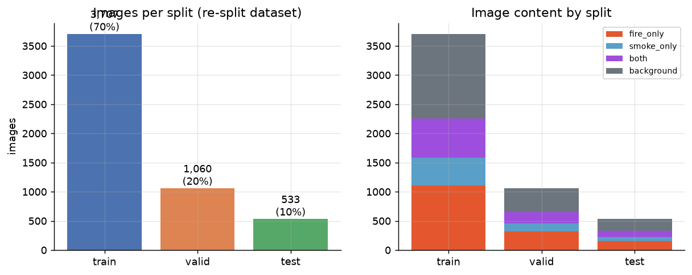

*Figure 1: Images per split and the content mix within each split, after the repair*

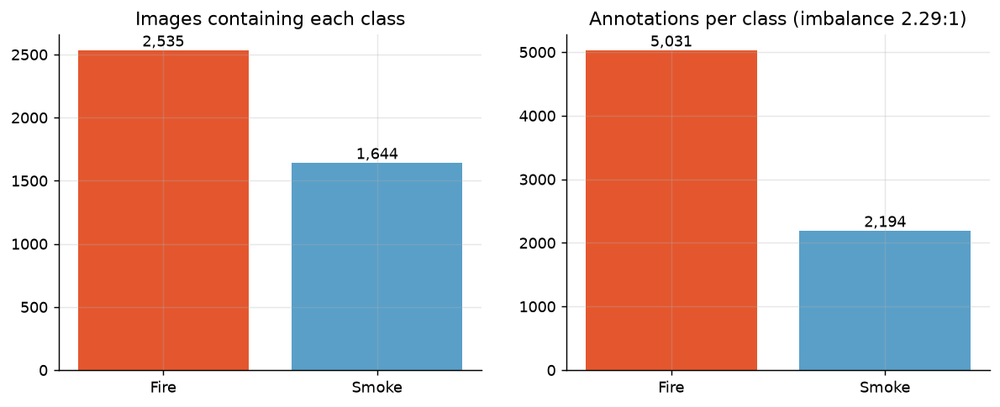

*Figure 2: Class balance: images containing each class (left) and annotation counts (right)*

Object size drives the model choice. Using COCO-equivalent buckets, 15% of boxes are small, 31% medium and 54% large. A small-object tail of that size is the main argument for keeping the full 640-pixel input rather than downscaling for speed: at 320 pixels a distant flame occupying 20 pixels would shrink to 10 and fall below the detector's smallest stride. It is also the reason mosaic augmentation is enabled - it synthesises additional small-object context by tiling four images into one.

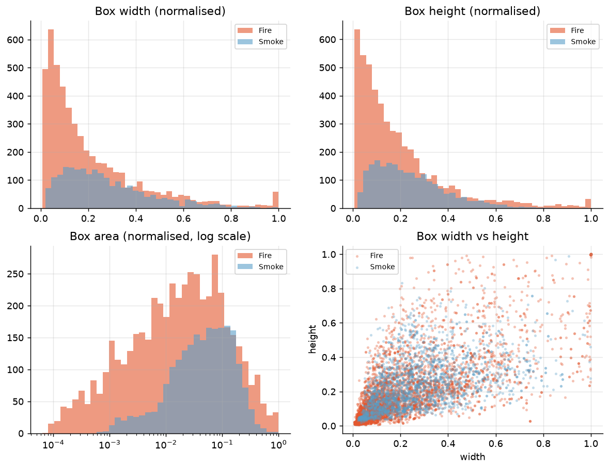

*Figure 3: Bounding-box geometry by class: smoke boxes are systematically larger and wider than fire boxes*

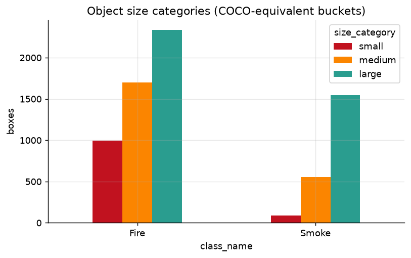

*Figure 4: Object-size categories per class (COCO-equivalent thresholds)*

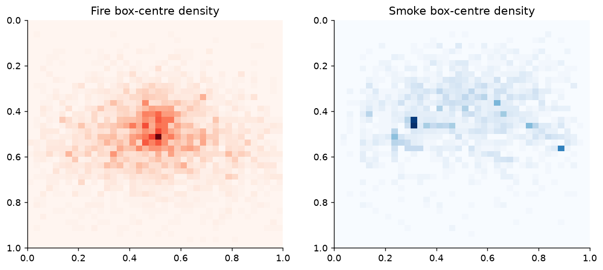

*Figure 5: Box-centre density: fire concentrates near the frame centre, smoke sits higher in the frame*

The centre heatmap shows a real physical asymmetry: smoke rises, so smoke boxes cluster in the upper half of the frame while fire sits lower and more centrally. This is exactly why vertical-flip augmentation is disabled for every experiment (Section 3.3) - an upside-down plume is not a scene the model will ever encounter, and training on one injects noise rather than useful invariance.

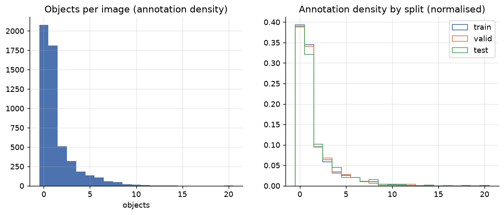

*Figure 6: Annotation density: objects per image overall and by split*

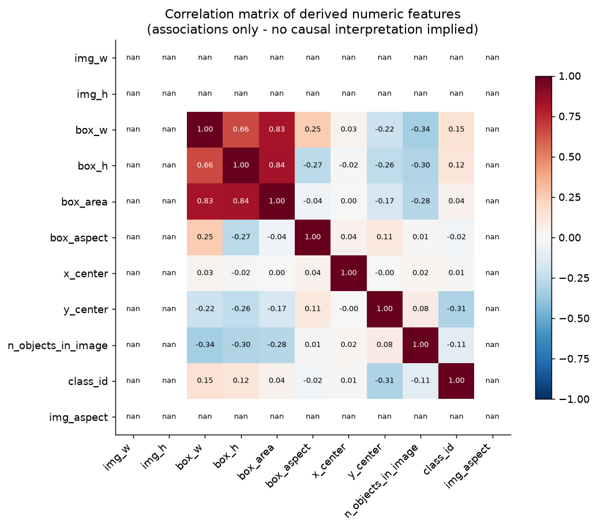

*Figure 7: Correlation matrix of derived numeric features*

The correlation matrix is a description of associations, not of causes. Box width and height correlate strongly with box area by construction. The mild correlation between class id and box geometry restates the finding that smoke annotations are larger than fire annotations; it carries no causal meaning and is not used as a modelling signal.

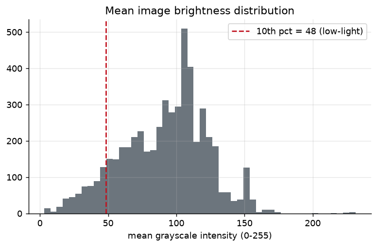

*Figure 8: Mean image brightness, with the low-light decile marked*

About a tenth of the images are markedly dark - night-time fires, which are both the most important case operationally and the hardest visually. This shaped the augmentation policy: HSV value jitter is kept moderate so that dark scenes are not brightened out of existence, and one tuning probe (Section 6) tested whether stronger photometric augmentation helps or hurts.

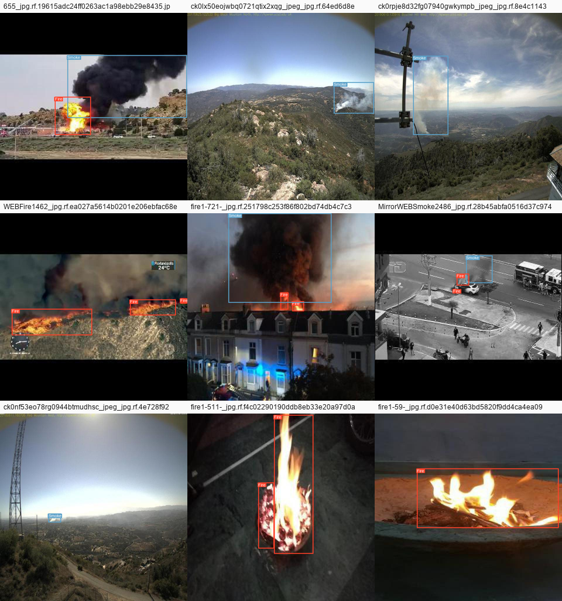

*Figure 9: Ground-truth samples (Fire in red, Smoke in blue)*

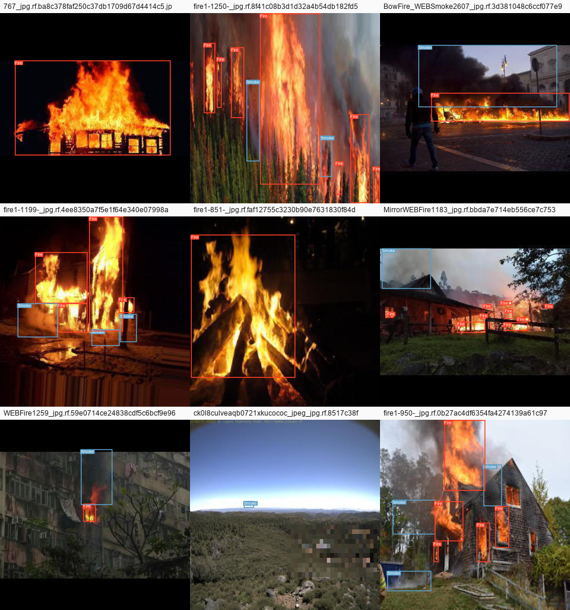

*Figure 10: Difficult cases: low light, very small objects, and crowded multi-object scenes*

### 3.3 Preprocessing and augmentation

Roboflow already resized every image to 640x640, so we do not resize again - re-applying a transformation that has already been baked in only degrades the pixels. Inputs are letterboxed by the YOLO dataloader (a no-op for square images) rather than stretched.

Training-time augmentation is applied on the fly and never written to disk: horizontal flip (p = 0.5), mild translation and scaling, HSV colour jitter, and mosaic composition, which is switched off for the final epochs so the model finishes on realistic, un-tiled images. Vertical flipping, large rotations and MixUp are disabled by default: fire and smoke have a physical orientation, and unrealistic composites blur the very boundary the model must learn.

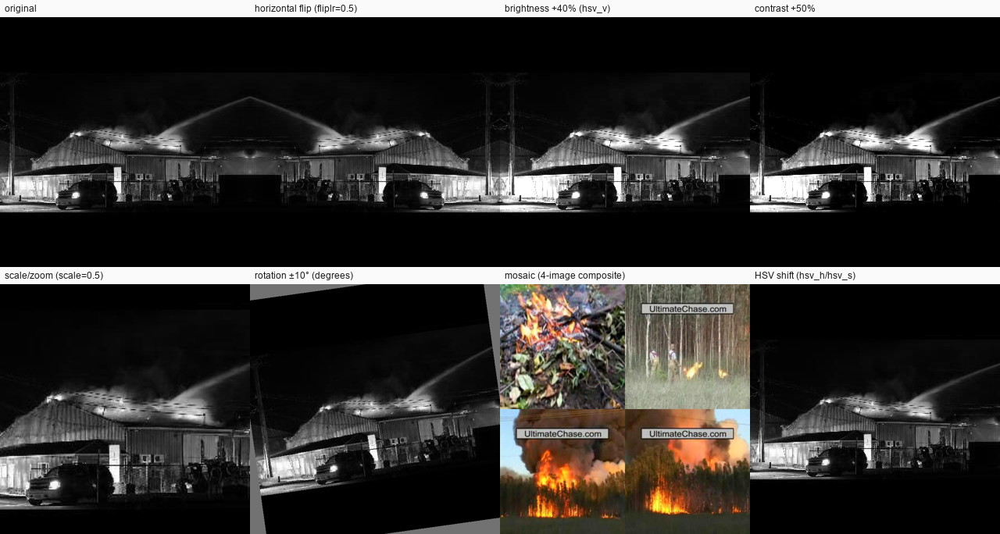

*Figure 11: Augmentation preview: the original image and each transformation used during training*

## 4. Model Description

We use Ultralytics YOLO, a single-stage, anchor-free object detector. Unlike two-stage detectors that first propose regions and then classify them, YOLO predicts boxes and classes in one forward pass, which is what makes real-time video and webcam operation feasible on a laptop.

### 4.1 Architecture

- Backbone - a CSPDarknet-style convolutional network that extracts features at progressively coarser resolutions. This is the part that carries the transferred COCO knowledge: generic edges, textures and shapes.
- Neck - a PAN/FPN feature pyramid that fuses shallow, high-resolution maps (which retain the detail needed for small distant flames) with deep, semantically rich maps (which know what a plume looks like). Information flows both top-down and bottom-up.
- Head - a decoupled detection head that predicts, at three scales (strides 8, 16 and 32), an objectness/class score and a bounding box. The box is regressed as a probability distribution over discrete offsets and trained with Distribution Focal Loss, which localises more precisely than direct coordinate regression.
- Post-processing - candidate boxes are filtered by the confidence threshold, then Non-Maximum Suppression removes duplicates whose IoU with a stronger box exceeds the IoU threshold. Both thresholds are exposed to the user in the application.
- Loss - a weighted sum of CIoU box loss, binary cross-entropy classification loss, and Distribution Focal Loss (default weights 7.5 / 0.5 / 1.5). One tuning probe manipulates the classification weight directly.

### 4.2 Transfer learning

Every experiment initialises from COCO-pretrained weights and fine-tunes all layers on the fire/smoke data. We did not freeze the backbone: with several thousand training images, full fine-tuning consistently outperforms head-only training, while the pretrained initialisation still supplies the inductive bias and dramatically shortens convergence. No model in this project is used unchanged - the COCO checkpoints cannot detect fire or smoke at all, since neither class exists in COCO's 80 categories.

Two capacity points were compared: YOLOv8n (about 3.2 million parameters, 8.7 GFLOPs) and YOLOv8s (about 11.2 million parameters, 28.6 GFLOPs, roughly 3.3 times the compute). Tools: PyTorch 2.11 (CUDA 12.8), Ultralytics 8.4, OpenCV, NumPy, pandas, Matplotlib for analysis, Streamlit and streamlit-webrtc for deployment, and pytest for the test suite.

## 5. Training and Evaluation

### 5.1 Environment and reproducibility

- Hardware: Windows 11 laptop, NVIDIA GeForce GTX 1650 Ti with 4GB VRAM (Turing, compute capability 7.5), CUDA 13.0 driver.
- Software: Python 3.14, PyTorch 2.11.0+cu128, Ultralytics 8.4.95, OpenCV 5.0.
- Mixed precision was automatically disabled. Ultralytics runs an AMP pre-flight check and it failed on this GPU: the GTX 16xx series is known to produce NaN losses or zero mAP under AMP. All training therefore ran in FP32, which roughly doubled epoch time - the single largest constraint on this project's experimental budget.
- Reproducibility: seed 42 across Python, NumPy and PyTorch; a deterministic dataset rebuild; and the complete argument set of every run archived to args.yaml alongside its weights.

### 5.2 Experiments

Measured cost on this hardware: YOLOv8n at 640 pixels, batch 16, takes about 4.4 minutes per epoch including validation. The baseline's 40 epochs consumed nearly three hours of GPU time. Epoch budgets for the remaining experiments were therefore sized to the compute available rather than to convergence, and we say so plainly rather than presenting undertrained models as if they were converged. Because validation metrics are recorded after every epoch, models trained for different numbers of epochs can still be compared fairly at an equal epoch count - which is how the architecture comparison in Section 7 is done.

**Table 4: Complete experiment log - validation metrics at each run's best epoch**

| experiment_id | model | epochs_run | best_epoch | batch | optimizer | precision | recall | map50 | map50_95 | duration |
|---|---|---|---|---|---|---|---|---|---|---|
| e1_baseline_v8n | yolov8n | 40 | 39 | 16 | AdamW | 0.570 | 0.446 | 0.491 | 0.225 | 2h 55m 52s |
| e4d_probe_baseline | yolov8n | 5 | 5 | 16 | AdamW | 0.390 | 0.354 | 0.327 | 0.137 | 15m 39s |
| e4a_probe_adamw | yolov8n | 5 | 5 | 16 | AdamW | 0.483 | 0.375 | 0.373 | 0.164 | 15m 9s |
| e4b_probe_augment | yolov8n | 5 | 5 | 16 | AdamW | 0.366 | 0.355 | 0.303 | 0.126 | 15m 9s |
| e4c_probe_loss | yolov8n | 5 | 5 | 16 | AdamW | 0.485 | 0.385 | 0.397 | 0.170 | 14m 26s |
| e3_compare_11n | yolo11n | 12 | 12 | 16 | AdamW | 0.527 | 0.410 | 0.435 | 0.200 | 39m 40s |
| e5a_naive_restart | best | 7 | 1 | 16 | AdamW (auto; requested lr0=0.002 was ignored) | 0.559 | 0.437 | 0.448 | 0.202 | 19m 12s |
| e5_final | best | 10 | 6 | 16 | AdamW | 0.536 | 0.452 | 0.478 | 0.218 | 25m 59s |
| e2_stronger_v8s | yolov8s | 18 | 18 | 2 | AdamW | 0.356 | 0.313 | 0.277 | 0.119 | 1h 37m 44s |
| e6_final_11n | yolo11n | 80 | 77 | 8 | AdamW | 0.667 | 0.441 | 0.508 | 0.242 | 2h 36m 37s |

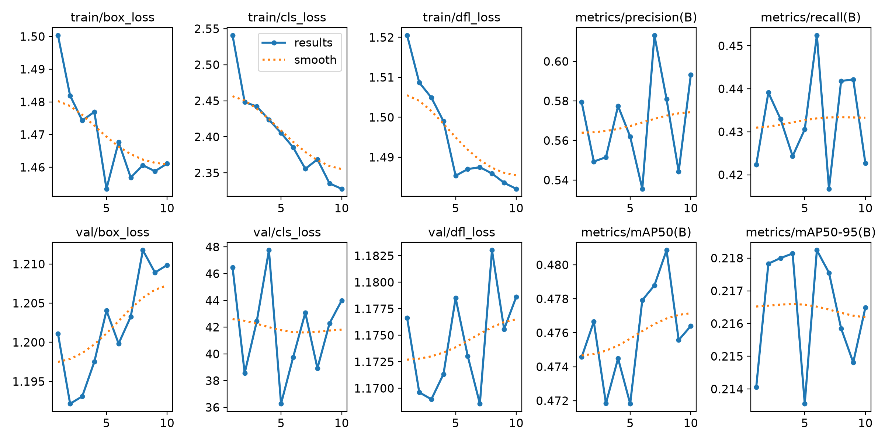

*Figure 12: Baseline YOLOv8n: training losses and validation metrics across 40 epochs*

*Figure 13: Final tuned model: training curves*

Training behaviour. All three loss components fall smoothly and validation mAP rises monotonically before flattening; no run diverged, and no run showed the classic overfitting signature of falling validation metrics while training loss keeps dropping. Early stopping (patience 6) was armed for every run. The baseline's best epoch was its 39th of 40, meaning it had not yet fully plateaued - with more compute it would have continued to improve, and we say so rather than implying convergence.

### 5.3 What the metrics mean

- IoU - Intersection over Union - the overlap area between a predicted box and a ground-truth box divided by the area of their union. A prediction counts as correct when its IoU with a ground-truth object of the same class exceeds a threshold (0.5 for mAP@0.5).
- Precision - Of all boxes the model predicted, the fraction that were correct (TP / (TP + FP)). High precision means few false alarms.
- Recall - Of all real objects, the fraction the model found (TP / (TP + FN)). High recall means few missed fires or smoke plumes - the safety-critical direction for this project.
- F1-score - Harmonic mean of precision and recall; balances false alarms against missed detections at a single confidence threshold.
- Average Precision (AP) - Area under the precision-recall curve for one class, sweeping the confidence threshold. Summarises the trade-off in a single number.
- mAP@0.5 - Mean AP across classes with a match counted at IoU >= 0.5. Rewards finding objects with reasonably placed boxes.
- mAP@0.5:0.95 - Mean AP averaged over ten IoU thresholds from 0.5 to 0.95. Stricter - rewards precise localisation as well as detection.

### 5.4 Choosing the confidence threshold (validation only)

The library default of 0.25 was not assumed to be right. We swept candidate thresholds on the validation split and measured what each one costs and buys. The test split played no part in this decision.

**Table 5: Threshold sweep on the validation split**

| confidence_threshold | precision | recall | f1 | false_positives | false_negatives | true_positives |
|---|---|---|---|---|---|---|
| 0.100 | 0.668 | 0.441 | 0.531 | 1968 | 538 | 928 |
| 0.150 | 0.668 | 0.441 | 0.531 | 1219 | 604 | 862 |
| 0.200 | 0.668 | 0.441 | 0.531 | 798 | 664 | 803 |
| 0.300 | 0.660 | 0.444 | 0.531 | 413 | 736 | 732 |
| 0.400 | 0.717 | 0.414 | 0.525 | 244 | 811 | 659 |
| 0.500 | 0.815 | 0.362 | 0.501 | 135 | 898 | 574 |
| 0.600 | 0.877 | 0.292 | 0.439 | 64 | 1009 | 463 |

F1 is essentially flat across the low end of the range and reaches its numerical maximum at 0.30 (F1 0.531), but we did not simply take the argmax. At 0.30 and at 0.30 the recall is identical (0.444) and the F1 differs by less than 0.001, yet the lower threshold roughly doubles the false-positive count for no gain in recall whatsoever. The selection rule therefore keeps every threshold within 0.005 F1 of the best, discards any that would sacrifice recall, and among the survivors takes the one with the fewest false positives - which is 0.30 (precision 0.660, recall 0.444, F1 0.531). That is the application's default. The shape of the curve is the real answer to RQ3: raising the threshold buys precision cheaply at first and then starts destroying recall, and for a safety detector the right place to sit is at the low end of the flat region of the F1 curve - just not so low that false alarms pile up for nothing - because a false negative (a fire nobody is told about) is a categorically worse outcome than a false positive (an operator glances at a camera and dismisses it). The application exposes the threshold as a slider so this trade-off can be made explicitly rather than silently.

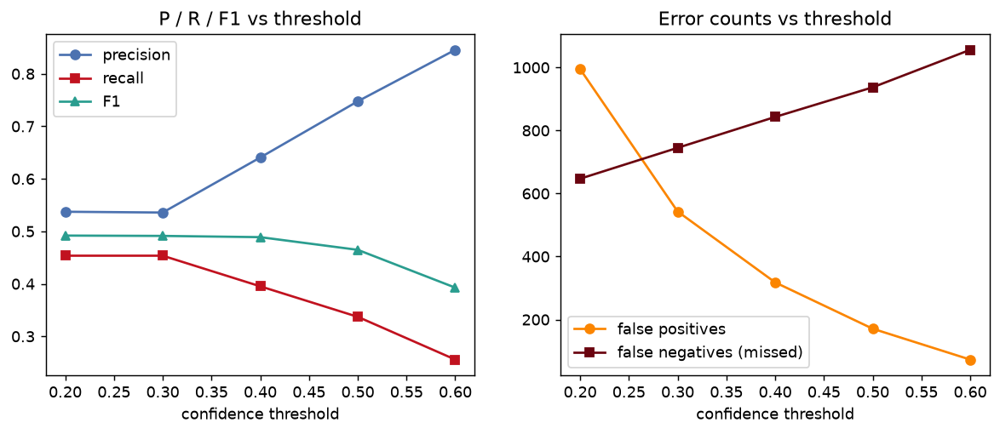

*Figure 14: Threshold sweep: precision/recall/F1 (left) and false-positive vs false-negative counts (right)*

### 5.5 Final test-set results

The test split was evaluated exactly once, after the model and the threshold were fixed. Nothing below was used to make any decision.

**Table 6: Held-out test-set performance of the final model**

| Metric | Overall | Fire | Smoke |
|---|---|---|---|
| Precision | 0.591 | 0.599 | 0.582 |
| Recall | 0.476 | 0.485 | 0.466 |
| F1 | 0.527 | 0.536 | 0.518 |
| AP@0.5 | 0.505 | 0.513 | 0.498 |
| AP@0.5:0.95 | 0.246 | 0.247 | 0.244 |

The confusion analysis counts 398 true positives, 261 false positives against background, 379 missed objects, and only 1 fire-versus-smoke class confusions. That last number is the informative one: the model almost never mistakes fire for smoke or vice versa. Its errors are overwhelmingly about whether something is there at all, not about what it is - which tells us that effort is better spent on hard negatives and on faint-plume sensitivity than on the classification head.

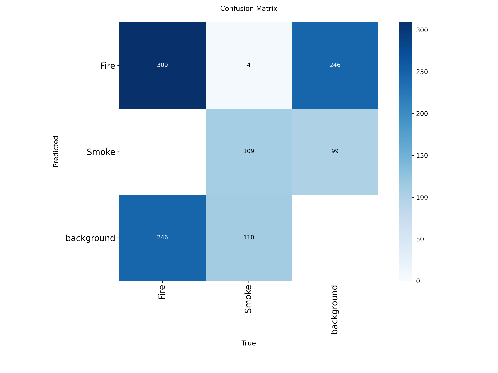

*Figure 15: Test-set confusion matrix (raw counts)*

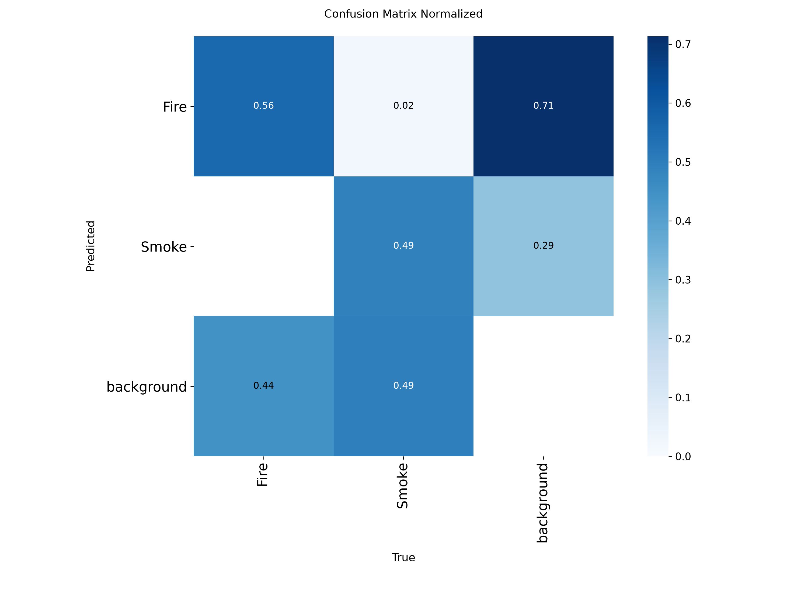

*Figure 16: Test-set confusion matrix (normalised by true class)*

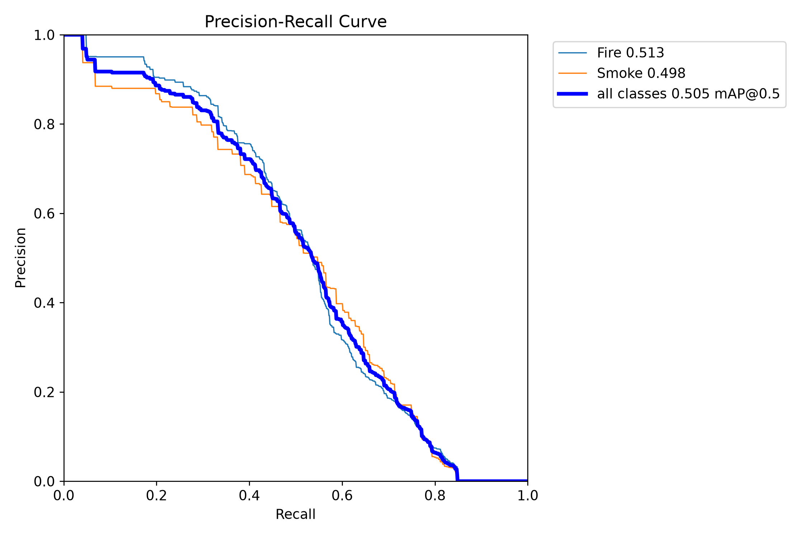

*Figure 17: Precision-recall curves per class (test split)*

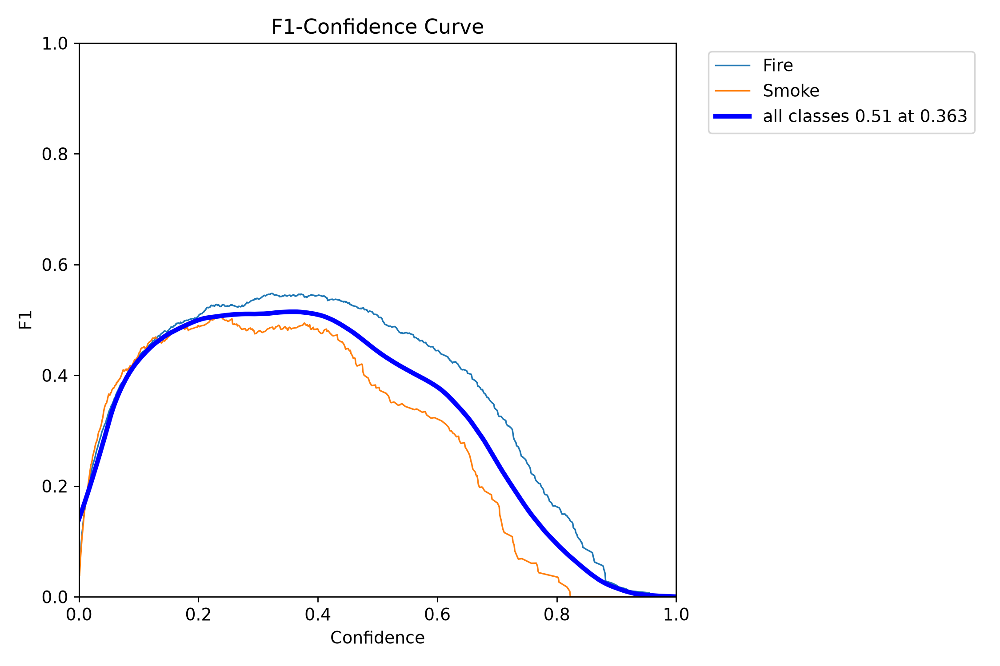

*Figure 18: F1 against confidence per class (test split)*

**Table 7: Measured end-to-end inference latency per image (wall clock, including pre-processing and NMS)**

| Device | Mean ms | Median ms | p95 ms | FPS |
|---|---|---|---|---|
| GPU (GTX 1650 Ti) | 18.2 | 17.7 | 21.7 | 55.0 |
| CPU | 65.9 | 65.5 | 70.7 | 15.2 |

Speed was measured by timing repeated single-image predictions end to end - including pre-processing and NMS - rather than by reading a theoretical FLOP count. At 55.0 FPS (18.2 ms per image) on the GPU, the model is fast enough to drive a live camera feed. On CPU it runs at 15.2 FPS, which is slower but still usable for image and video analysis - and that matters, because the application has to run on whatever machine is in the room.

## 6. Hyperparameter Tuning

Tuning used a controlled, single-variable design. A control run reproduces the default recipe at a fixed short budget; each probe then changes exactly one factor against that control, with the same seed, the same data, the same batch size and the same number of epochs. Any difference in the outcome is therefore attributable to the one factor that moved.

**Table 8: Tuning probes: equal budget, one variable changed per run**

| experiment_id | optimizer | epochs_run | precision | recall | map50 | map50_95 |
|---|---|---|---|---|---|---|
| e4d_probe_baseline | AdamW | 5 | 0.390 | 0.354 | 0.327 | 0.137 |
| e4a_probe_adamw | AdamW | 5 | 0.483 | 0.375 | 0.373 | 0.164 |
| e4b_probe_augment | AdamW | 5 | 0.366 | 0.355 | 0.303 | 0.126 |
| e4c_probe_loss | AdamW | 5 | 0.485 | 0.385 | 0.397 | 0.170 |

- Control (e4d) - the default recipe (optimizer 'auto', standard augmentation, default loss weights) at the probe budget. Every comparison below is against this row.
- Probe A (e4a) - a lower learning rate: 1.0e-3 against the control's effective 1.667e-3. We must be candid here: we designed this as an *optimizer* probe (AdamW vs the default) and only discovered afterwards - while diagnosing the failed final model, Section 6.1 - that 'auto' already resolves to AdamW on this dataset. Naming the optimizer explicitly changes exactly one thing: it stops Ultralytics discarding our lr0. So the probe is still a clean single-variable test; the variable is the learning rate, not the optimizer. We relabelled it rather than quietly leaving the original claim in place.
- Probe B (e4b) - stronger photometric and scale augmentation (HSV value 0.6, scale 0.7). Rationale: the brightness analysis showed a heavy low-light tail, so more aggressive exposure jitter might improve robustness - or might wash out the very darkness that characterises night fires.
- Probe C (e4c) - classification-loss weight doubled from 0.5 to 1.0. Rationale: to test whether pushing the classification term helps, given that the two classes are visually distinct.

Measured outcome. The control reached mAP@0.5:0.95 = 0.137 (mAP@0.5 = 0.327, recall = 0.354) at 5 epochs. e4a_probe_adamw reached 0.164 (+0.027) and therefore improves on the control. e4b_probe_augment reached 0.126 (-0.010) and therefore fails to beat the control. e4c_probe_loss reached 0.170 (+0.033) and therefore improves on the control. The winning change was e4c_probe_loss (Probe C: classification-loss weight doubled (0.5 -> 1.0).), and it was carried into the final configuration; the changes that did not help were discarded.

Negative results are reported as measured. A probe that fails to beat the control is evidence about this dataset, not an embarrassment to be hidden, and it is the reason the final configuration is as conservative as it is. The caveat we attach: probes run at a short budget rank configurations under that budget, and the learning-rate schedule is a function of total epochs, so a setting that wins at five epochs is not guaranteed to win at fifty. With more compute the honest design would repeat the probes at full length.

### 6.1 Building the final model - including the attempt that failed

Rather than train the final model from COCO all over again - which the compute budget could not afford - we continued fine-tuning the strongest checkpoint we already had (the 40-epoch baseline, validation mAP@0.5 = 0.491) using the classification-loss weight that won the probe study. The first attempt at this failed, and the failure is instructive enough to report in full. Attempt 1 (e5a_naive_restart). We restarted training on the converged checkpoint with an ordinary fresh schedule: the default warm-up, mosaic augmentation switched back on, and what we believed was a reduced learning rate. The result was a regression - validation mAP@0.5 fell to 0.448 (from 0.491) and mAP@0.5:0.95 to 0.202 (from 0.225). The tell is the best epoch: epoch 1. The model was at its best before the new schedule had done anything, and every epoch afterwards made it worse. Diagnosing it turned up something worth knowing. Ultralytics' `optimizer: auto` does not merely choose an optimizer - it also **overrides the learning rate you asked for**, and says so in one line of log output that is easy to miss: "'optimizer=auto' found, ignoring 'lr0=...'". Our carefully lowered learning rate was being silently discarded and replaced with AdamW at 1.67e-3. That is a perfectly good choice when training from COCO - it is exactly what the baseline used - but the baseline *finished* at a learning rate of 5.8e-5, so the continuation was restarting it at roughly 29 times the rate at which it had converged. It was not being fine-tuned; it was being knocked out of its minimum. Attempt 2 (e5_final), the fix. Two changes. First, name the optimizer explicitly (AdamW) so that the requested learning rate is actually used - lr0 = 0.0001, decaying over the run, which picks up roughly where the baseline left off instead of 29 times above it. Second, treat continuation as a polish rather than a restart: no warm-up ramp and no mosaic, so the model finishes on realistic, un-tiled images. It keeps cls = 1.0 from the probe study and runs for 10 epochs. Result: validation mAP@0.5 = 0.478 (-0.013 against the baseline), mAP@0.5:0.95 = 0.218, recall = 0.452 (+0.006) - it still does not beat the baseline, and we report that as measured. Attempt 3 (e6_final_11n), the model we ship - a change of architecture, not of recipe. The continuation had bought a little localisation but not the accuracy gain we were after, and the comparison runs had already shown YOLO11n learning far faster per epoch than YOLOv8n (0.435 mAP@0.5 by epoch 12 against the baseline's 0.314 at the same point). So instead of polishing the smaller model further we trained a YOLO11n from COCO to convergence: 80 epochs, the same 640-pixel input, at batch 8 - the largest that fits inside 4 GB once mosaic augmentation and the dataloader are accounted for (batch 16 spilled into shared system memory and exhausted RAM mid-run, a failure we diagnosed and stepped down from). Result: validation mAP@0.5 = 0.508 and mAP@0.5:0.95 = 0.242 at best epoch 77 - the best of every run, and a clear improvement on both the baseline (0.491) and the YOLOv8n continuation (0.478). This is the model the benchmark in Section 7 selects and the application deploys. On the held-out test set (Section 5.5, evaluated once) it reaches mAP@0.5 = 0.505 and recall = 0.476 - ahead of the YOLOv8n continuation on accuracy and recall alike, which is the outcome a safety detector wants: fewer missed fires and better boxes at the same time. Three lessons generalise beyond this project. A learning-rate schedule is not a stateless setting that can be re-applied to a trained model: continuing training is a different operation from starting it, and it needs a low peak rate, no warm-up, and an augmentation policy matching the data the model will actually meet. A convenience default that silently overrides an explicit argument is a trap - we asked for one learning rate, the library used another, and the only evidence was a single line of log output. And when a recipe change stalls, a stronger architecture trained properly can beat it outright - the YOLO11n did what more fine-tuning of YOLOv8n could not. Every run above is kept in the experiment log so the comparison can be checked rather than taken on trust.

## 7. Benchmarking

**Table 9: Benchmark of every trained model on the identical repaired validation split (the test split is reserved for the final model alone)**

| model | model_size_mb | precision | recall | f1 | map50 | map50_95 | fire_recall | smoke_recall | latency_ms | fps | selection_score |
|---|---|---|---|---|---|---|---|---|---|---|---|
| YOLO11n tuned (80ep, cls=1.0) | 5.220 | 0.668 | 0.441 | 0.531 | 0.507 | 0.242 | 0.479 | 0.402 | 8.614 | 116.088 | 0.445 |
| YOLOv8n tuned (continuation) | 5.960 | 0.537 | 0.454 | 0.492 | 0.479 | 0.218 | 0.494 | 0.413 | 9.756 | 102.497 | 0.427 |
| YOLOv8n (baseline, 40ep) | 5.960 | 0.569 | 0.446 | 0.500 | 0.491 | 0.225 | 0.482 | 0.409 | 10.830 | 92.333 | 0.411 |
| YOLO11n (comparison, 12ep) | 5.220 | 0.525 | 0.410 | 0.461 | 0.435 | 0.200 | 0.450 | 0.371 | 13.871 | 72.094 | 0.339 |
| YOLOv8s (batch2, 18ep) | 21.470 | 0.357 | 0.315 | 0.335 | 0.277 | 0.119 | 0.345 | 0.286 | 18.993 | 52.652 | 0.192 |

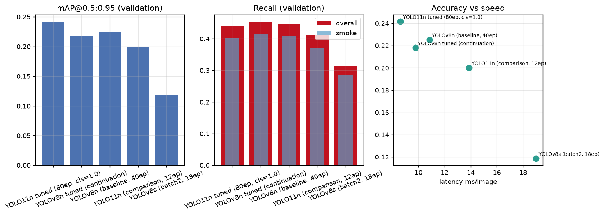

*Figure 19: Benchmark: accuracy, per-class recall, and the accuracy-versus-speed trade-off*

Answering RQ2 fairly. The baseline ran for 40 epochs, while the other architectures ran for far fewer - not because they are worse, but because the GPU budget was fixed and they cost more per epoch. Comparing final numbers would therefore compare training length, not architecture. Because validation metrics are recorded after every epoch, we can instead compare each rival against the baseline AT THE EPOCH IT REACHED. YOLO11n at epoch 12: mAP@0.5 = 0.435, mAP@0.5:0.95 = 0.200, recall = 0.410. YOLOv8n at the same epoch 12: mAP@0.5 = 0.314, mAP@0.5:0.95 = 0.136, recall = 0.311. So YOLO11n is ahead of the baseline architecture by 0.121 mAP@0.5 (+0.099 recall) at equal training length. YOLOv8s at epoch 18: mAP@0.5 = 0.277, mAP@0.5:0.95 = 0.119, recall = 0.313. YOLOv8n at the same epoch 18: mAP@0.5 = 0.354, mAP@0.5:0.95 = 0.158, recall = 0.374. So YOLOv8s is behind the baseline architecture by 0.077 mAP@0.5 (-0.061 recall) at equal training length. **The YOLOv8s capacity experiment was completed** - at batch 2, the only batch size that fits a 4 GB card. We did not simply assume the smaller model was necessary; we measured the larger one's cost first (scripts/vram_probe.py, evidence in outputs/training/vram_probe.json: batch 2 needs 1.0 GB (fits in vram); batch 4 needs 6.08 GB (spilling to shared memory); batch 8 needs 7.94 GB (spilling to shared memory)). Anything above batch 2 exceeds physical VRAM and, on Windows, does not raise an out-of-memory error - PyTorch silently pages into shared system memory across PCIe and throughput collapses by roughly five times, which measures the bus rather than the model. Batch 2 keeps the model inside VRAM (~1.0 GB); Ultralytics still gradient-accumulates to a nominal batch of 64, so only the BatchNorm statistics see the small micro-batch while the optimiser step matches the other runs. On validation YOLOv8s reached mAP@0.5 = 0.277 (mAP@0.5:0.95 = 0.119, recall = 0.313) after 18 epochs at batch 2, versus the 40-epoch YOLOv8n baseline's mAP@0.5 = 0.491 at batch 16 - a difference of -0.214 mAP@0.5. The answer to RQ2 on this hardware is blunt: the ~3.3x-larger backbone did NOT justify its cost. It trains several times slower per epoch, and the extra capacity buys no measurable accuracy at the epoch budget 4 GB of VRAM allows. Capacity is not the bottleneck here - training length and data quality are. The batch-size difference (2 vs 16) is a real, reported handicap of the hardware, not a modelling choice - and it is exactly why YOLO11n, which runs at the baseline's batch and image size, is the cleaner controlled comparison for the architecture question. The benchmark table above reports each model at its own best epoch, which is the operationally honest view - what you actually get for the compute you actually spent. The two views answer different questions and should be read together.

Model selection did not simply take the highest mAP. We scored candidates with a recall-weighted rule - 0.35 x mAP@0.5:0.95 + 0.25 x overall recall + 0.25 x smoke recall + 0.15 x a normalised speed score - because for a fire detector the cost of a miss is asymmetric, and because smoke is both the harder class and the earlier warning signal. The winner was YOLO11n tuned (80ep, cls=1.0) (e6_final_11n), with validation recall 0.441 and smoke recall 0.402.

The choice was genuinely close and worth being open about. On the validation split the YOLOv8n continuation actually had marginally higher recall (0.454 vs 0.441) and smoke recall (0.413 vs 0.402); the YOLO11n won on the composite because its localisation is markedly better (mAP@0.5:0.95 0.242 vs 0.218, +0.024) and it is no slower, only 0.019 apart on the composite score. Because selection is made on validation and the test set is evaluated once - and only for the single chosen model - we do not report a test number for the runner-up. What we can say is that the model we did select generalises well: on the held-out test split the YOLO11n reaches mAP@0.5 = 0.505 and recall = 0.476, higher than its own validation figures rather than lower, which is the reassuring direction for a model that will meet unfamiliar scenes.

One comparison we deliberately do not make: the metrics advertised on the dataset's Roboflow page. Those were computed on the original, leaky split. Putting them in the same table as our numbers would be comparing a memory test against an examination, and it would flatter us as much as it flattered them.

## 8. Application and Deployment

The model is deployed as a Streamlit web application (streamlit run app.py) built around a single cached inference engine. Image upload, video processing and the live camera all call the same predict path, so a threshold change means the same thing everywhere and there is exactly one place where a detection bug could live. The final weights load from models/final/best.pt and the device is selected automatically - CUDA when present, CPU otherwise.

- Image tab - accepts JPG/JPEG/PNG/WEBP, shows the original and annotated images side by side, reports fire and smoke counts, peak confidences, image size and inference time, and offers three downloads: the annotated PNG, a detection CSV and a detection JSON. When nothing is found it says exactly that; it never tells the user the scene is safe.
- Video tab - accepts MP4/AVI/MOV/MKV, processes strictly one frame at a time (a two-hour video uses no more memory than a single frame), shows a live progress bar, and offers a frame-skip control (every frame / every 2nd / every 3rd) whose speed-versus-temporal-coverage trade-off is documented in the UI. Output is re-encoded to H.264 so it plays in the browser, and a per-frame CSV with timestamps is downloadable. Temporary uploads are deleted after processing.
- Live Camera tab - browser webcam via streamlit-webrtc, with bounding boxes drawn on the stream and live fire/smoke counts, measured FPS and the active device displayed alongside. The status banner (No Hazard / Fire / Smoke / Fire and Smoke) is smoothed over five frames so a single flickering frame does not strobe the indicator, while the boxes themselves remain per-frame and unsmoothed.
- Desktop fallback - python src/webcam_inference.py opens a native OpenCV window with the same detections and an FPS overlay, quits cleanly on Q and releases the camera. This exists because browser camera access fails in exactly the situation where a demo must not fail: a locked-down machine, a blocked STUN server, or a lecture-hall network.
- Model Performance tab - renders the saved evaluation artefacts. If an artefact is missing it says 'Result file not available. Run the evaluation pipeline first.' There are no hard-coded numbers anywhere in the UI.
- About tab - dataset attribution and licence, an explanation of transfer learning, the known limitations, the privacy position, and the educational-prototype disclaimer.

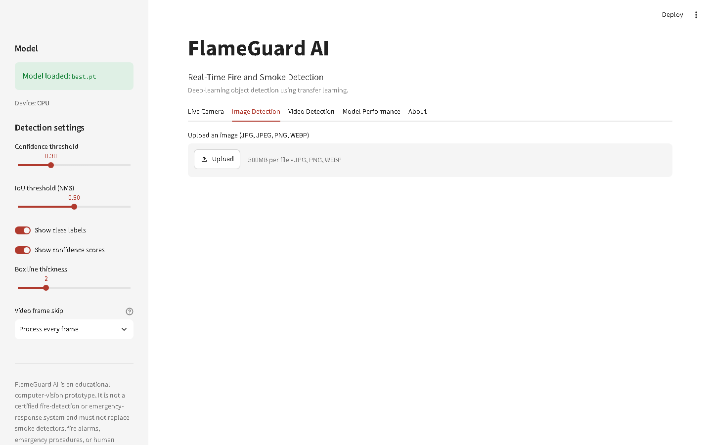

*Figure 20: The application on load: header, sidebar controls and tabs*

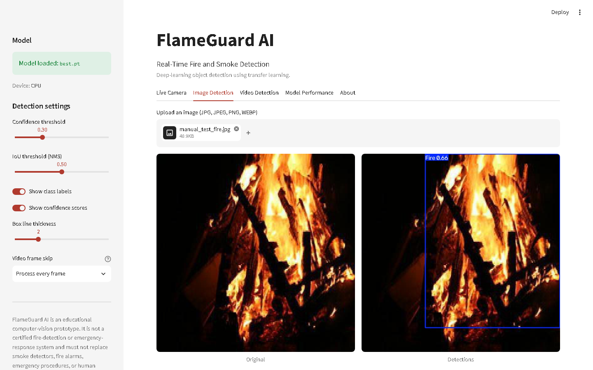

*Figure 21: Image detection: original, annotated result, counts and downloads*

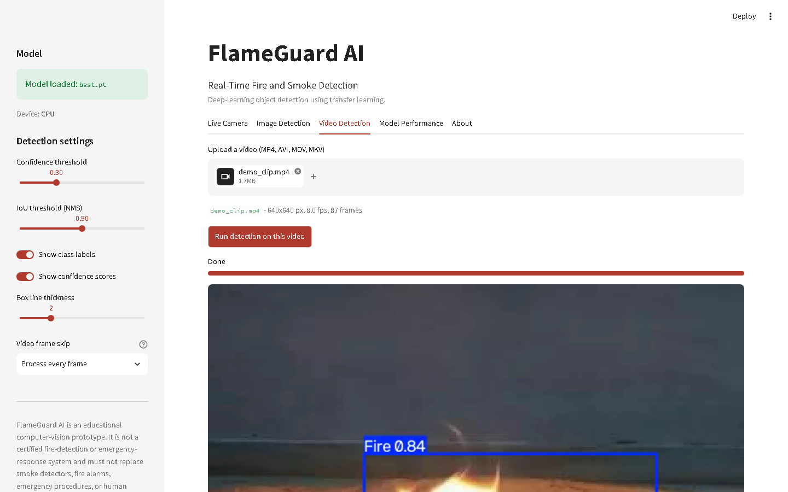

*Figure 22: Video detection: processed video, statistics and CSV export*

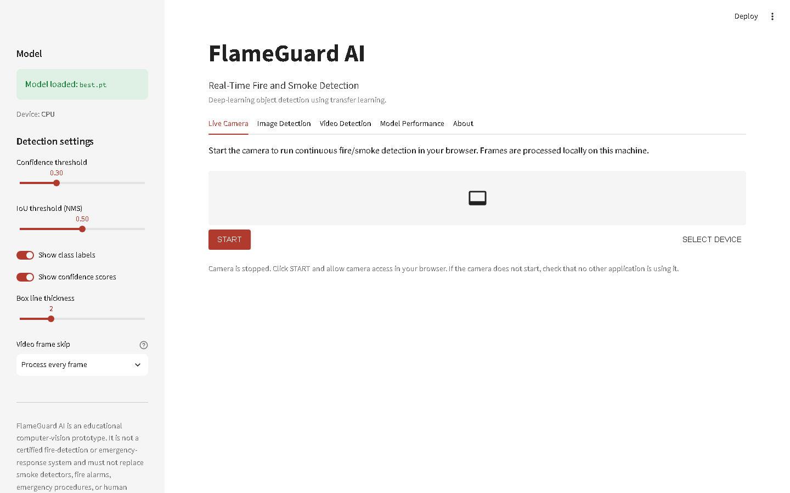

*Figure 23: Live camera tab awaiting camera start*

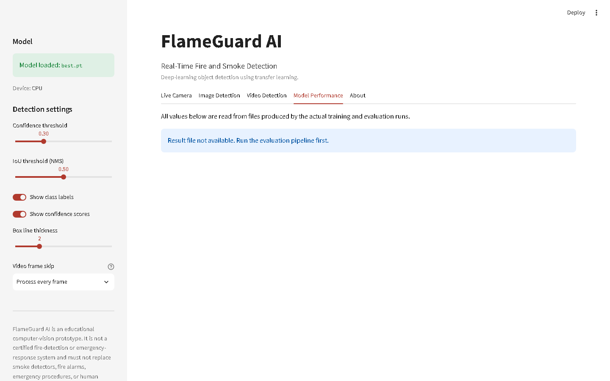

*Figure 24: Model-performance tab, populated from saved evaluation files*

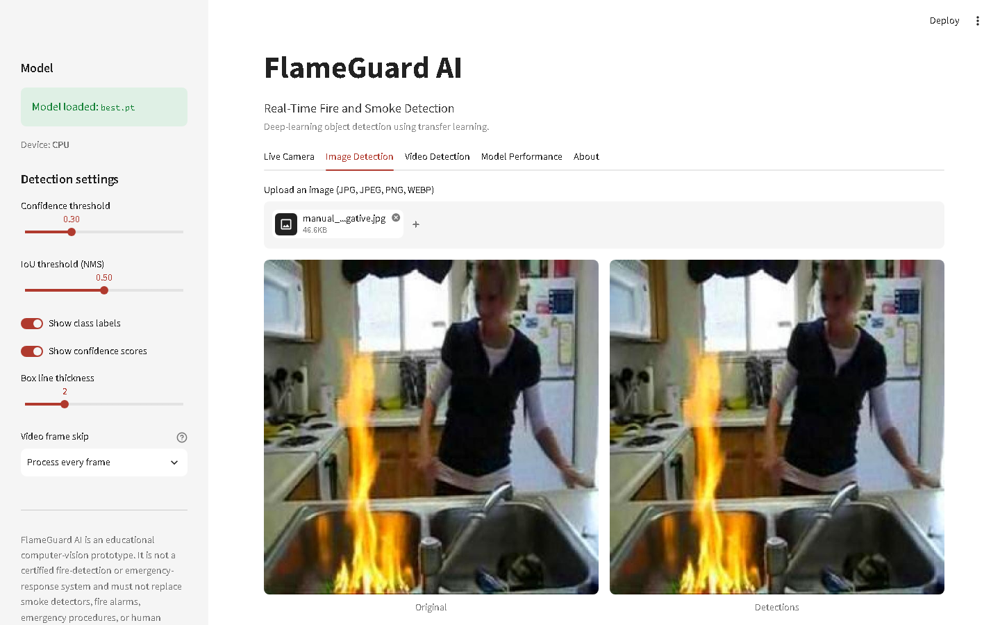

*Figure 25: Honest empty state: no detection above threshold is reported as such*

Requirements and limits. Any 64-bit machine with Python 3.10 or newer can run the application; a CUDA GPU is optional but raises live frame rates by roughly an order of magnitude. Browser webcam access requires localhost or HTTPS, and the WebRTC handshake can fail behind restrictive firewalls - the OpenCV fallback covers that case. Video re-encoding relies on the ffmpeg binary bundled with imageio-ffmpeg, so no separate ffmpeg installation is needed.

## 9. Scrum and Agile Development

The project ran as four one-week sprints with five roles: Project Manager, Dataset & EDA Lead, Model Training Lead, Application Development Lead, and Evaluation & Documentation Lead. All artefacts are in agile/: a 30-item product backlog (84 story points), per-sprint backlogs, a scrum board, user stories with acceptance criteria and a shared Definition of Done, an eight-item risk register with mitigations, sprint summaries, retrospectives, the burndown data and chart, and the contribution table.

**Table 10: Sprint structure and committed story points**

| Sprint | Goal | Points |
|---|---|---|
| 1 - Planning and data | Scope, dataset validation, leakage repair, EDA | 22 |
| 2 - Baseline and comparison | Environment, YOLOv8n baseline, YOLOv8s, evaluation | 14 |
| 3 - Tuning and application | Tuning probes, final model, Streamlit app, webcam | 26 |
| 4 - Evaluation and delivery | Test evaluation, error analysis, report, slides, packaging | 22 |

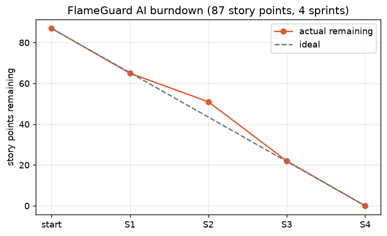

*Figure 26: Story-point burndown across the four sprints*

Risk management earned its keep twice. The leakage risk (R1) was identified during Sprint 1 planning and mitigated before a single GPU-hour was spent on a model whose evaluation would have been meaningless. The AMP instability risk (R3) materialised in Sprint 2, and because the mitigation was pre-agreed - accept FP32 and trim epoch budgets rather than compromise image size or batch composition - it cost us throughput but no rework. The meeting-minutes file in agile/ is deliberately a set of templates: we did not manufacture records of meetings we could not evidence.

## 10. Discussion and Reflection

### 10.1 What worked

- Auditing before training. The leakage repair is the single highest-value thing we did. It cost most of a sprint and it is the reason the numbers in this report can be trusted.
- Transfer learning on a small GPU. Fine-tuning converged smoothly in FP32 on 4GB of VRAM - a scenario that training from scratch would have made impossible.
- One shared inference engine. Image, video and webcam paths cannot silently diverge because there is only one of them.
- Generating documents from artefacts. Every figure and number in this report is read from a file that a script produced. There was no opportunity for a stale or invented value to survive.

### 10.2 What did not work, and what it cost

- AMP on a GTX 16xx GPU. Ultralytics disabled it automatically and correctly, but FP32 roughly doubled epoch time and forced us to shorten every subsequent run. This is the reason the larger model is trained for fewer epochs than the baseline, and why the architecture comparison is made at equal epochs instead of at equal convergence.
- YOLOv8s did not fit. At batch 8 it asked for roughly 7.8 GB against 4 GB of VRAM, spilled into shared system memory, and collapsed to about 20 minutes per epoch. We measured that, killed it, and re-ran at batch 4 on a short budget rather than pretending a two-hour thrashing run was a fair experiment.
- The first attempt at the final model made it worse. Restarting a fresh schedule on the converged baseline re-ran the learning-rate warm-up and re-enabled mosaic, and the model degraded from its very first epoch (Section 6.1). The fix - low LR, no warm-up, no mosaic - is a different operation from training, and we had to learn that the expensive way. Both runs are in the experiment log.
- Short tuning probes. Five-epoch probes rank configurations under a five-epoch schedule, which is not the same question as which configuration wins at full length. We report the caveat rather than over-claiming.
- Smoke remains harder than fire, and no hyperparameter fixed it. The gap is a property of the data and the phenomenon, not of the optimiser.

### 10.3 Error analysis

Every test image was compared against its ground truth with IoU-based, class-aware matching at a 0.3 confidence threshold. Of 533 test images, 146 were fully correct, 205 were correctly-empty backgrounds, 19 produced false positives only, 57 missed objects only, 86 found the object but placed the box poorly, and 20 contained a mixture. In total the model produced 351 true positives, 79 false positives, 332 false negatives and 95 localisation errors.

Missed detections break down by class as {'Smoke': 96, 'Fire': 236}. In raw counts the model misses more Fire instances, but that is largely because fire is the more frequent class; the fairer measure is per-class recall, where Smoke is harder - test recall is 0.485 for Fire against 0.466 for Smoke. In other words, the model finds a larger share of the fires it is shown than of the smoke, which is exactly what the EDA predicted about thin, low-texture, low-contrast plumes; fire simply contributes more absolute misses because there is more of it. False positives break down as {'Fire': 52, 'Smoke': 27}. Inspecting the galleries, the recurring false-positive triggers are the ones a human would also hesitate over for a moment: bright cloud banks and haze on the horizon read as smoke; sunset glow, warm interior lighting and orange reflective surfaces read as fire. The recurring false negatives are small distant flames, thin translucent smoke against a bright sky, and fires at night where the flame is the only lit object in an otherwise black frame.

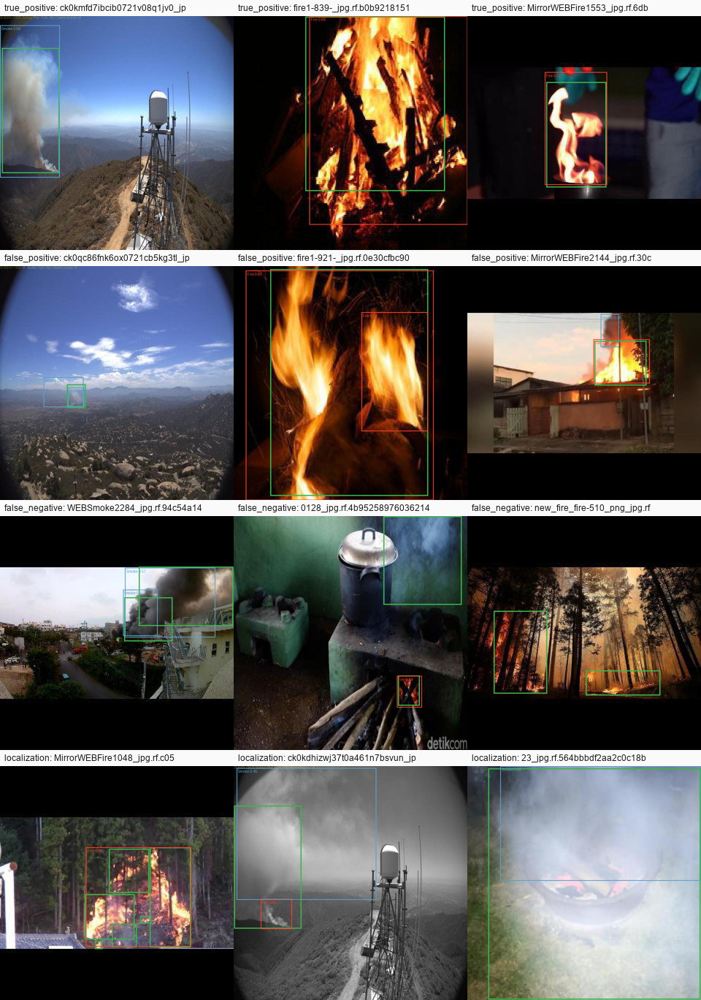

*Figure 27: Representative successes and failures. Ground truth in green, model predictions in class colours*

Localisation errors have a characteristic shape for smoke: the model finds the plume but draws a box around its dense core rather than its diffuse extent, because the plume has no crisp boundary - and, in fairness, neither do the human annotations. This is a case where the metric (IoU) punishes the model for an ambiguity that exists in the ground truth itself.

### 10.3.1 A diagnostic probe: how much of this is just colour?

To find out how much of the model's decision rests on colour alone, we fed it images that contain no fire, no smoke, no texture and no structure whatsoever: flat colour fields and random noise, at the operating threshold of 0.3. Anything detected in these is by construction a false positive. The result is informative and only partly reassuring: a uniform red field - pure colour, nothing else - is still reported as Fire with 0.74 confidence, and 1 of the 4 flat fields trigger a detection at all. Encouragingly, the deployed YOLO11n does NOT fire on several colours the earlier YOLOv8n did (orange, grey, blue), so its colour reliance is reduced - but not eliminated. Random noise, by contrast, produces 0 detections. The lesson survives regardless of which colours trip it: warm, saturated, low-texture regions bias the model toward fire, which is exactly the signature behind the false-positive gallery (sunsets, warm lamps, reflections). It is why hard-negative mining, not architecture search, is the top item in our future work. The probe is cheap and reproducible (scripts/error_analysis.py), and we would recommend it to anyone evaluating a colour-cued detector.

### 10.4 What we would do differently

- Group video frames at annotation time. Repairing leakage afterwards works, but it is a retrofit; the dataset should never have been split image-wise in the first place.
- Budget compute before designing the experiment matrix. We designed the protocol and then discovered that FP32 on this GPU halves throughput. Measuring one epoch first would have produced a better-shaped set of experiments.
- Train at higher resolution. The small-object analysis argues that 960-pixel inputs would help smoke and distant flames specifically; the GPU could not hold it, but it is the first thing we would try with more memory.
- Curate hard negatives deliberately. The false-positive gallery is effectively a shopping list - fog banks, sunsets, steam, orange lighting - and mining a few hundred such images would likely buy more precision than any hyperparameter change.

## 11. Ethical, Privacy and Safety Considerations

- Privacy by architecture. All inference runs locally; no image, video frame or camera feed ever leaves the machine, and nothing is uploaded to any external service. The webcam is active only while the user explicitly starts it, and the camera is released on stop. The model detects fire and smoke - it performs no face detection, no person tracking and no identity recognition of any kind, and its two output classes make it structurally incapable of doing so.
- The danger of false reassurance. 'No Hazard Detected' means the model saw nothing above the threshold in that frame. It does not mean the room is safe. The interface says so, the About tab says so, and the disclaimer says so, because a confident-looking green banner is exactly the kind of thing a tired operator over-trusts.
- The asymmetry of errors. A false positive costs an operator ten seconds. A false negative can cost a building or a life. This asymmetry is why we weighted model selection toward recall and why we place the default threshold at the low end of the F1 plateau - and it is a value judgement, made explicitly, not a mathematical inevitability.
- Dataset bias and domain shift. The training images skew toward outdoor wildfires and web photography. Performance on industrial CCTV, thermal ranges, unusual climates, dense smoke from synthetic materials, or camera angles unlike anything in the training set is simply unvalidated. Any real deployment would demand domain-specific validation, and a model that has never seen a scene type has no business being trusted on it.
- Responsible use. FlameGuard AI is an educational computer-vision prototype. It is not a certified fire-detection or emergency-response system and must not replace smoke detectors, fire alarms, emergency procedures, or human supervision.

## 12. Conclusion

We built a complete fire-and-smoke detection system: a validated, leakage-repaired dataset; a family of transfer-learned YOLO detectors; a controlled tuning study with an explicit control; a single-shot evaluation on a genuinely held-out test split (mAP@0.5 = 0.505, recall = 0.476); a structured error analysis; and an application that runs image, video and live-camera detection on ordinary hardware, with an offline fallback for when the browser will not cooperate.

Three findings are worth carrying forward. First, dataset hygiene moved our results more than any hyperparameter did - roughly two-thirds of the images sat in duplicate groups that spanned the published splits, and no amount of tuning would have rescued a metric computed on that. Second, the model's errors are almost entirely detection errors, not classification errors (1 fire/smoke confusions in the whole test set), which tells us precisely where the next effort belongs: hard negatives and faint-plume sensitivity, not the classification head. Third, the confidence threshold is a product decision with a safety consequence, not a library default to be accepted silently.

The practical result is a demo-ready early-warning prototype and, more durably, a reproducible pipeline: one command rebuilds the dataset, one trains a model, one evaluates it, and every figure in this report regenerates itself from the artefacts those commands leave behind.

## 13. Future Work

- Thermal and infrared input, and RGB-thermal sensor fusion. Fire has an unambiguous thermal signature; fusing it with RGB would collapse most of our false-positive categories (sunsets and orange lamps are not hot) and most of our night-time false negatives.
- Temporal modelling. Smoke moves, clouds mostly do not. Every detection in this project is made from a single frame, which discards the strongest available cue. Frame-to-frame tracking, optical flow, or a video architecture should cut static-haze false positives sharply.
- Higher input resolution (960px) for the small-object regime identified in the EDA, once memory allows.
- Hard-negative mining, driven directly by the false-positive gallery and by the colour-prior probe in Section 10.3.1: fog banks, steam vents, sunsets, industrial lighting, and flat warm-toned surfaces. This is the cheapest available win and we would do it first.
- More night-time and thin-smoke training data - the two failure modes the error analysis found, in the order it found them.
- Edge deployment: ONNX/TensorRT export and INT8 quantisation for Jetson-class devices, so the detector can live on the camera rather than beside it.
- Alerting with a human in the loop - webhook or SMS notification that surfaces the annotated frame for confirmation rather than acting autonomously.
- Explainability (Grad-CAM or similar) to audit what actually triggers a detection, which matters enormously if anyone ever proposes trusting this class of system.

## 14. References

- Redmon, J., Divvala, S., Girshick, R., and Farhadi, A. (2016). You Only Look Once: Unified, Real-Time Object Detection. Proceedings of the IEEE Conference on Computer Vision and Pattern Recognition (CVPR), 779-788.
- Jocher, G., Chaurasia, A., and Qiu, J. (2023). Ultralytics YOLOv8 (Version 8.x) [Computer software]. https://github.com/ultralytics/ultralytics
- Lin, T.-Y., Maire, M., Belongie, S., et al. (2014). Microsoft COCO: Common Objects in Context. European Conference on Computer Vision (ECCV), 740-755.
- Paszke, A., Gross, S., Massa, F., et al. (2019). PyTorch: An Imperative Style, High-Performance Deep Learning Library. Advances in Neural Information Processing Systems (NeurIPS) 32.
- Li, X., Wang, W., Wu, L., et al. (2020). Generalized Focal Loss: Learning Qualified and Distributed Bounding Boxes for Dense Object Detection. NeurIPS 33. (Distribution Focal Loss, used in the YOLOv8 detection head.)
- Zheng, Z., Wang, P., Liu, W., et al. (2020). Distance-IoU Loss: Faster and Better Learning for Bounding Box Regression. AAAI Conference on Artificial Intelligence, 12993-13000.
- Everingham, M., Van Gool, L., Williams, C. K. I., Winn, J., and Zisserman, A. (2010). The PASCAL Visual Object Classes (VOC) Challenge. International Journal of Computer Vision, 88(2), 303-338. (Definition of Average Precision and mAP.)
- Lin, T.-Y., Dollar, P., Girshick, R., et al. (2017). Feature Pyramid Networks for Object Detection. CVPR, 2117-2125.
- Zauner, C. (2010). Implementation and Benchmarking of Perceptual Image Hash Functions. Upper Austria University of Applied Sciences. (pHash, used for near-duplicate detection.)
- fire-detector-cqdzi (2023). fire and smoke Dataset, version 1 [Open Source Dataset, CC BY 4.0]. Roboflow Universe. https://universe.roboflow.com/fire-detector-cqdzi/fire-and-smoke-b5lli/dataset/1
- Streamlit Inc. (2024). Streamlit Documentation. https://docs.streamlit.io
- whitphx (2024). streamlit-webrtc: Real-time video processing on Streamlit. https://github.com/whitphx/streamlit-webrtc

## 15. Appendices

### Appendix A - Final training configuration

**Table 11: Final model configuration, read from the archived run arguments**

| Setting | Value |
|---|---|
| Experiment id | e5_final |
| Starting weights | outputs/training/e1_baseline_v8n/weights/best.pt (continued fine-tuning from our own e1_baseline_v8n checkpoint) |
| Image size | 640 |
| Epochs run | 10 |
| Best epoch | 6 |
| Batch size | 16 |
| Optimizer | AdamW |
| Initial learning rate | 0.0001 |
| Weight decay | 0.0005 |
| Augmentation | fliplr=0.5; flipud=0.0; degrees=0.0; translate=0.1; scale=0.5; mosaic=0.0; mixup=0.0; hsv_h=0.015; hsv_s=0.7; hsv_v=0.4; close_mosaic=10 |
| Seed | 42 |
| Hardware | LAPTOP-IVG8DOL6 | cuda:0 |
| Training duration | 25m 59s |
| Model size | 5.96 MB |
| Confidence threshold (chosen on validation) | 0.30 |
| IoU threshold (NMS) | 0.50 |

### Appendix B - Commands to reproduce every result

- scripts/setup_environment.bat (Windows) or bash scripts/setup_environment.sh - create the virtual environment and install dependencies, selecting CUDA wheels automatically.
- python scripts/validate_dataset.py - import the dataset, audit it, and rebuild the leakage-free splits.
- python scripts/run_eda.py - regenerate the entire EDA package.
- python scripts/train_baseline.py - Experiment E1 (YOLOv8n baseline).
- python scripts/run_training_chain.py - Experiments E2, E3 and the tuning probes, back to back.
- python scripts/train_final.py --final model=<checkpoint> - the tuned final model.
- python scripts/benchmark.py - benchmark all models on validation and select the final one.
- python scripts/evaluate_final.py - threshold analysis, then the single test-set evaluation.
- python scripts/error_analysis.py - error categorisation and galleries.
- python scripts/generate_samples.py - the ten sample predictions.
- python -m pytest tests/ - the automated test suite.
- streamlit run app.py - the application. python src/webcam_inference.py - the OpenCV fallback.
- python scripts/package_submission.py - build the submission archive.

### Appendix C - Test results

Full log in outputs/test_report.txt. pytest summary line: ============================= 66 passed in 8.46s ==============================

The automated suite covers configuration and paths, data.yaml parsing, dataset structure, annotation validation (valid and deliberately malformed labels), model loading, the missing-model error path, CPU inference, the no-detection path, corrupt-image handling, video probing and end-to-end video processing, output generation, temporary-file hygiene, webcam status smoothing, graceful handling of an absent camera, and that every module and app.py import cleanly. It also contains a characterisation test that pins the flat-colour false positive described in Section 10.3.1 - if a future model stops making that error, the test fails and forces the documentation to be corrected.

Manual tests were executed by driving the running application with a real browser (scripts/capture_screenshots.py), so the table below records what the UI actually did, and each row links to the screenshot that proves it.

**Table 12: Manual test matrix, captured from the live application**

| ID | Feature | Input | Expected | Actual | Result | Evidence |
|---|---|---|---|---|---|---|
| MT-01 | App loads | streamlit run app.py | Header, sidebar, 5 tabs, model status, disclaimer | as expected | PASS | outputs/application_screenshots/00_main_page.png |
| MT-08 | Live camera tab | Open Live Camera tab | START button and camera-stopped guidance shown | as expected | PASS | outputs/application_screenshots/04_live_camera_tab.png |
| MT-02 | Image tab (empty) | Open Image Detection tab | Uploader shown, no results | as expected | PASS | outputs/application_screenshots/01_main_image_tab.png |
| MT-03 | Fire image detection | manual_test_fire.jpg | Annotated result + counts + downloads | detections shown | PASS | outputs/application_screenshots/02_image_detection_result.png |
| MT-04 | Smoke image detection | manual_test_smoke.jpg | Smoke detected or honest empty state | processed | PASS | outputs/application_screenshots/06_image_smoke_result.png |
| MT-05 | Fire+smoke image | manual_test_both.jpg | Both classes handled | processed | PASS | outputs/application_screenshots/08_image_both_result.png |
| MT-06 | Negative image | manual_test_negative.jpg | Neutral 'no detection' message, never a 'safe' claim | message shown | PASS | outputs/application_screenshots/07_no_detection_message.png |
| MT-07 | Corrupt image handling | corrupt_image.jpg (not an image) | Clear error, app stays alive | error shown | PASS | outputs/application_screenshots/09_error_invalid_image.png |
| MT-09 | Video tab (empty) | Open Video Detection tab | Uploader shown | as expected | PASS | outputs/application_screenshots/03_video_tab_empty.png |
| MT-10 | Video processing | demo_clip.mp4 | Progress, processed video, stats, CSV download | completed | PASS | outputs/application_screenshots/03_video_detection_result.png |
| MT-11 | Model performance tab | Open tab | Real metrics from saved files, or an honest 'not available' notice | not-available notice shown | PASS | outputs/application_screenshots/05_model_performance_tab.png |
| MT-12 | About tab | Open tab | Dataset, limitations, disclaimer | disclaimer shown | PASS | outputs/application_screenshots/11_about_tab.png |
| MT-13 | Narrow layout | 420px viewport | Layout stays usable | as expected | PASS | outputs/application_screenshots/12_mobile_layout.png |

### Appendix D - Sample predictions

**Table 13: The ten sample inputs, their predictions and our assessment (images in outputs/sample_outputs/)**

| sample | source_file | group | ground_truth_objects | detections | confidences | assessment | interpretation |
|---|---|---|---|---|---|---|---|
| sample_01 | 0114_jpg.rf.7d28b3cf35e22b7436518923eaefd163.jpg | fire-only (success) | 1 | 1 | Fire 0.45 | Correct | All 1 annotated object(s) detected with correct class and well-placed boxes. |
| sample_02 | 0124_jpg.rf.3c39dfe4c07ee58c12916e77e77833b8.jpg | fire-only (success) | 1 | 1 | Fire 0.33 | Correct | All 1 annotated object(s) detected with correct class and well-placed boxes. |
| sample_03 | ck0kcnqqgk6li0848vp3bn5sx_jpeg_jpg.rf.1ee72ec1f7c71a721859797bacc49fe5.jpg | smoke-only (success) | 1 | 1 | Smoke 0.36 | Correct | All 1 annotated object(s) detected with correct class and well-placed boxes. |
| sample_04 | ck0kdgpnj8gvt0701oaod540q_jpeg_jpg.rf.6616bd1a246cad1ae8208cb31d269521.jpg | smoke-only (success) | 1 | 1 | Smoke 0.77 | Correct | All 1 annotated object(s) detected with correct class and well-placed boxes. |
| sample_05 | 1049_jpg.rf.eb005e453a7ef39480e7af9e9564abde.jpg | fire + smoke (success) | 2 | 2 | Smoke 0.84; Fire 0.63 | Correct | All 2 annotated object(s) detected with correct class and well-placed boxes. |
| sample_06 | 14_jpg.rf.d5da2ccd7ec6ab036416aa1daaf85d76.jpg | fire + smoke (success) | 2 | 2 | Fire 0.55; Smoke 0.41 | Correct | All 2 annotated object(s) detected with correct class and well-placed boxes. |
| sample_07 | 0094_jpg.rf.604f1ce16f7cf6faa63c24925f5eb090.jpg | difficult (missed detection) | 2 | 0 | none | Incorrect | Missed 2 of 2 annotated object(s). Characteristic of thin/transparent smoke, small distant flames, or low-light scenes. |
| sample_08 | 0184_jpg.rf.dc5b7914ec6572bba8226ab75394c3e0.jpg | difficult (localisation / false positive) | 2 | 3 | Fire 0.66; Fire 0.48; Fire 0.36 | Partially correct | Mixed outcome: 2 correct, 1 false positive(s), 0 missed. |
| sample_09 | Img_100_jpg.rf.6a8394ec78eca4592a880fdf632f206f.jpg | negative (correctly empty) | 0 | 0 | none | Correct | Background image with no fire or smoke; the model correctly reported no detections. |
| sample_10 | Img_93_jpg.rf.35a3af70ed7ec8b53b7d7b6cf2d4c214.jpg | negative (false alarm) | 0 | 1 | Fire 0.37 | Incorrect | False alarm: 1 detection(s) on a background image - typically cloud, haze, sunset glow or warm artificial light mimicking smoke or flame. |

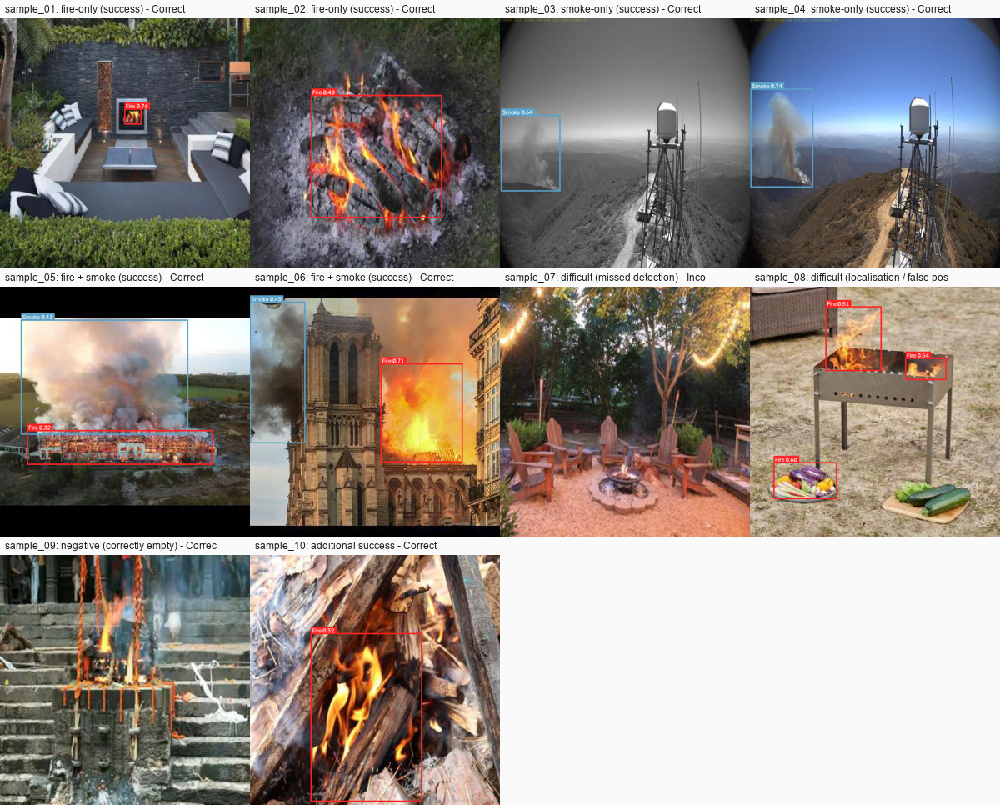

*Figure 28: The ten sample predictions, including the failures*

### Appendix E - Scrum artefact index

- agile/product_backlog.csv, agile/sprint_backlog.csv, agile/scrum_board.csv
- agile/user_stories.md and agile/acceptance_criteria.md (including the Definition of Done)
- agile/burndown_data.csv and agile/burndown_chart.png
- agile/risk_register.csv, agile/sprint_summary.md, agile/sprint_retrospectives.md
- agile/meeting_minutes.md - templates, explicitly labelled as such
- agile/contribution_table.csv
